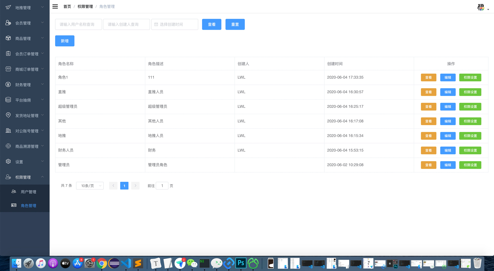
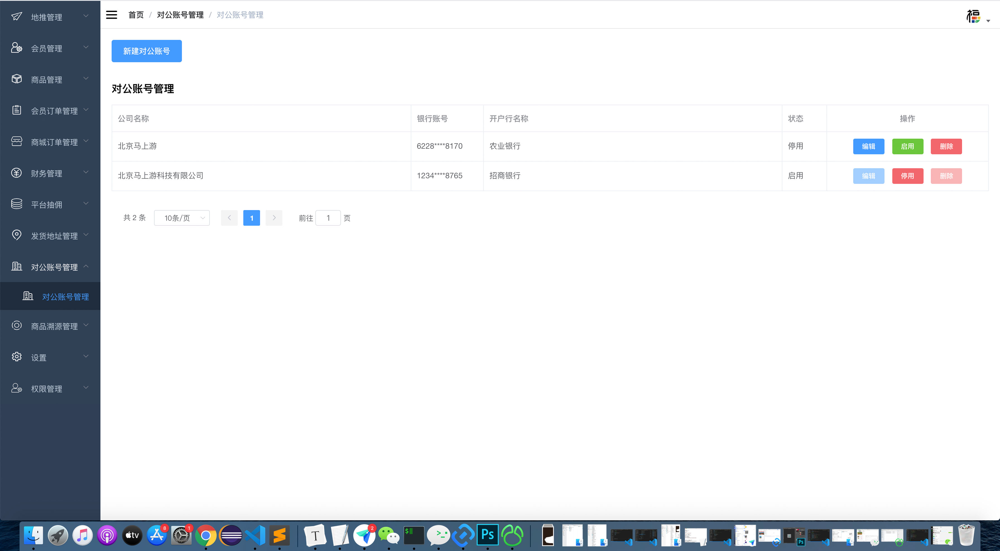
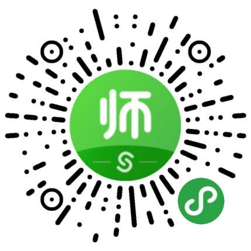

## 简历 - 高级前端工程师 - 裴梦槐
#### 联系方式
<ul>
	<li>电话：13366276991</li>
	<li>邮箱：xiame27@163.com</li>
	<li>微信：peimenghuai</li>
</ul>

#### 个人信息
<ul>
	<li>裴梦槐/男/1993</li>
	<li>本科/山西晋中学院 - 机械设计制造及其自动化</li>
	<li>工作年限：4年</li>
	<li>目前状况：在职</li>
	<li>期望职位：高级web前端工程师</li>
	<li>期望薪资：面议</li>
</ul>

#### 工作经历
##### 北京马上游科技有限公司（2019年9月～至今）

<ul>
	<li>马上游是一家文旅类的科技公司，业务涉及景区、区块链、溯源等。我在加入公司后、负责saas景区、商城等移动端业务与基于vue-element-admin的后台管理系统。为公司引入了node、TypeScript、taro等技术</li>
</ul>

<strong>易旅游</strong>
<ul>
	<li>该小程序属于从原有公司业务结合小程序的方式搭建（uni-app + webview），小程序端采用全es6的写法，原有页面把业务进行一个扩展（字节跳动小程序），涉及到的技能点如localstorage，scss，vw、vh单位等等</li>
	<li>在项目中，除了组件封装、页面还原等工作外，我对未来公司业务能涉及到的同类型程序做了业务抽象，将baseColor，singleId等参数配置到config文件中，在项目启动后进行initTemp()方法，选择要打包的项目（抖音or微信？商城or酒店？）</li>
</ul>

<strong>商城后台管理系统</strong>

项目地址：<a>http://polotrip.msy.cn/ft-admin/</a>

说明: 由于该项目已上线正式环境，故不提供账号密码等。

<ul>
	<li>该项目对vue-elemnt-admin进行二次封装，在原有项目中我对业务进行了抽象，通过config对baseColor、loginPage、routers、loginType、tableView等诸多业务场景进行了可自定义配置,在项目启动时，通过selectTemp（）方法进行模版选择。</li>
</ul>
<strong>项目截图</strong>

	
	

##### 北京弘成教育有限公司（2018年8月～2019年8月）

<ul>
	<li>弘成教育是一家与多院校合作的教育平台，公司涉及培训、教务系统平台研发、在线教育平台、在线答题、院校级考试平台等业务。</li>
</ul>

<strong>成考辅导通、教师资格精品课</strong>

在该项目中，我担任项目总负责人，涉及工作有:

<ul>
	<li>项目需求评审</li>
	<li>项目后端框架选型(koa2)</li>
	<li>数据库表结构设计(mysql)</li>
	<li>接口提供</li>
	<li>接口文档编写</li>
	<li>前端框架选型(mpvue)</li>
	<li>前端逻辑实现</li>
	<li>部分前端设计稿还原</li>
</ul>
项目地址：

		
		

##### 山西融创智联信息科技有限公司（2016年2月～2018年7月）

<ul>
	<li>融创智联信息是太原成立较早的一家中小型IT、计算机企业，涉及融创棋牌、太原路桥等国企型方面业务。在该公司，我跟部门领导与老板学到了很多前沿的前端技术，也快速由一个小白成长为一个可以独当一面的项目负责人。</li>
</ul>

<strong>库壳机器人编程</strong>

本项目中，前端采用vue-cli2脚手架实现公众号h5页面，采用原生的写法来实现微信小程序，在项目中，我担任前端负责人，负责忍下工作：

<ul>
	<li>分配另一个前端同事的工作，使用svn进行版本管理</li>
	<li>项目发布前进行项目的review（规范项目名、项目子文件夹、代码解耦、优化等）</li>
	<li>通过terminal的方式，进行项目打包上传</li>
	<li>页面的高度还原、前端组件封装</li>
</ul>
<strong>自身积累</strong>
<ul>
	<li>经过该项目，在对用户体验的优化上，我使用到一些以前未曾尝试过的技术，如：七牛云图片方式，在ui设计图经过tiny方式压缩后，再通过七牛云的方式，减少了图片加载慢的一个痛点；在以往的list请求种，我会每点击一个tab，去服务端拉去一次数据，本次开发，我对list数据进行本地存储，减少与服务端的交互，从而改善了节省了用户流量，提升了用户体验。</li>
</ul>
项目地址：
	

<strong>中国铁建项目安全质量管理平台</strong>

项目地址：<a>http://www.pmhuai.top:3001/railway/login.html</a>

测试账号：admin

测试密码：admin

说明: 由于该项目最终已部署在太原中铁局服务器下，已不对外开放，目前提供的是我个人版阿里云服务器（带宽、内存等较低）部署的测试版本。项目采用iframe + bootstrap的方式，故访问较慢。

<ul>
	<li>在该项目中，我主要负责登录模块、用户模块、角色模块、权限模块、系统设置等各模块的前、后端开发工作。项目周期3个月时长，通过该项目，我意识到单页面应用的不可替代性，并且在之后的项目中，更加注重对代码质量的提升。</li>
</ul>

##### 其他

除此之外，在平时的工作中，也涉及其他的一些项目如：echart类、layui早期项目、推广宣传活动页、微信公众号等。也有一些项目在保证顺利上线后，并没有经过量级的考验，在此就不一一列举了。

#### 技能

<ul>
	<li>熟练掌握HTML、CSS，能够快速完成静态页面，高效、快速地还原设计图</li>
	<li>能够熟练使用Javascript、Jquery来实现网页效果</li>
	<li>熟练使用BootStrap，能够快速实现响应式页面布局，并兼容PC端、移动端等设备</li>
	<li>熟练使用Vue快速构建单页面应用，配合element-ui、vant等ui框架高质量完成项目</li>
	<li>了解React，能够配合Antd Design快速完成项目需求，有React Native经验</li>
	<li>熟练掌握微信生态公众号、小程序的开发，熟练使用原生小程序、uni、taro高质量完成项目</li>
	<li>了解Koa、Thinkjs等node框架;掌握async、await并能良好地运用到项目中</li>
	<li>了解Pm2进程管理，了解nginx正、反向代理，熟悉命令行操作</li>
	<li>喜欢尝试新东西，对flutter、web3js、solidity有所涉猎</li>
</ul>

#### 致谢

感谢您花时间阅读我的简历，期待能有机会和您共事。

